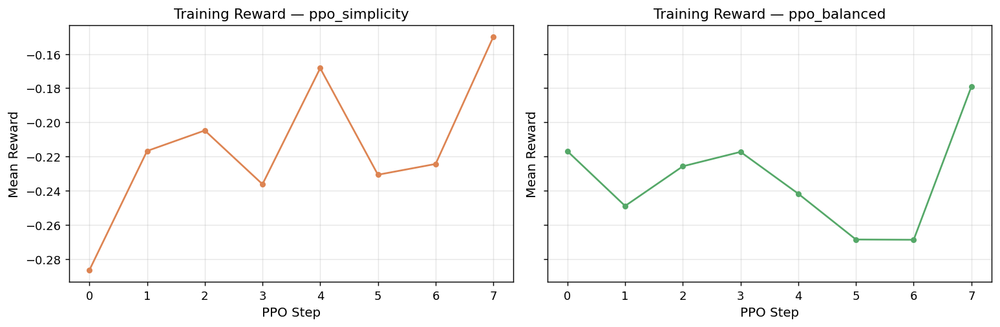
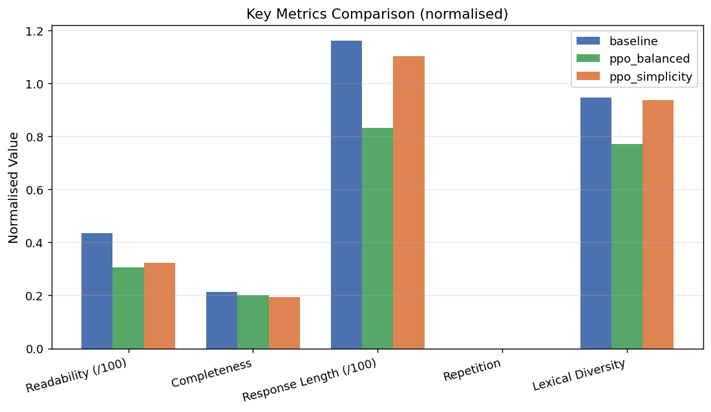
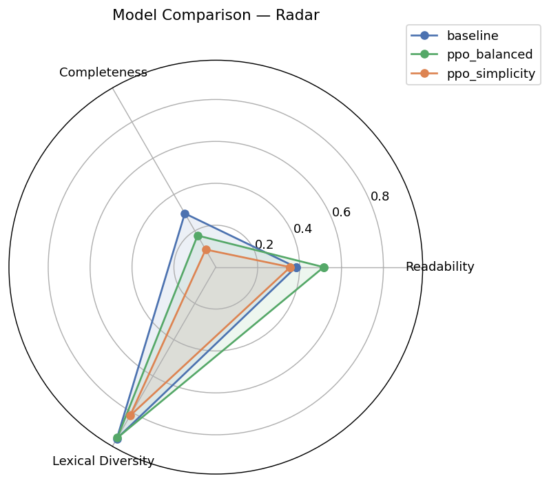
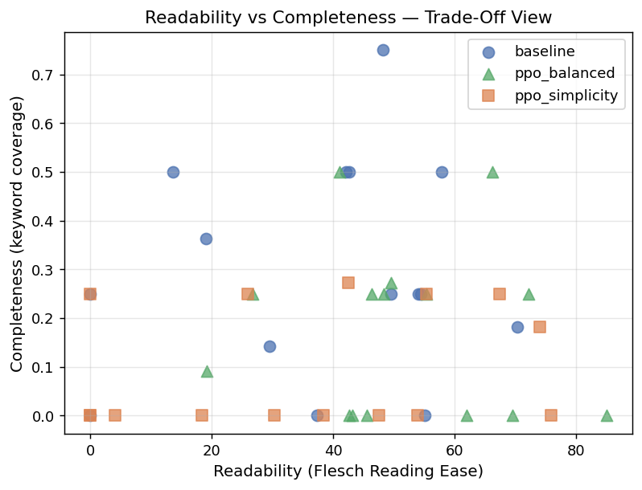
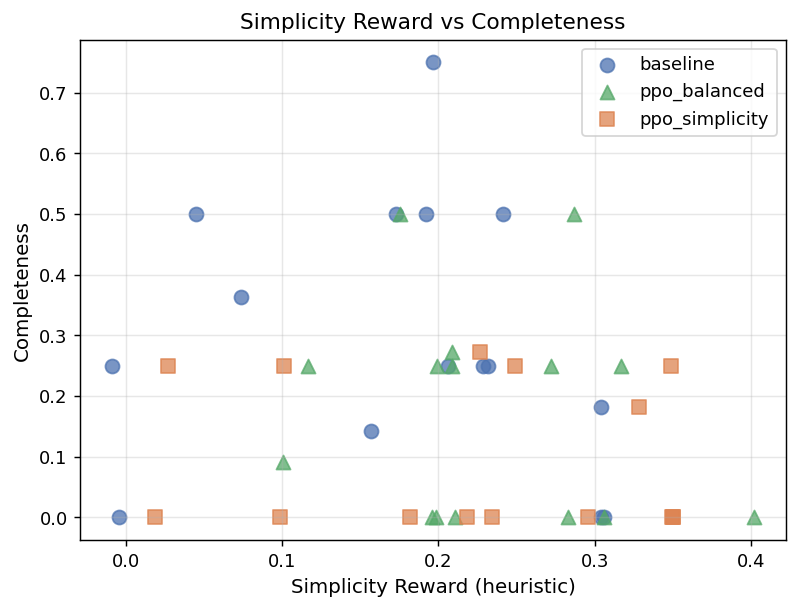
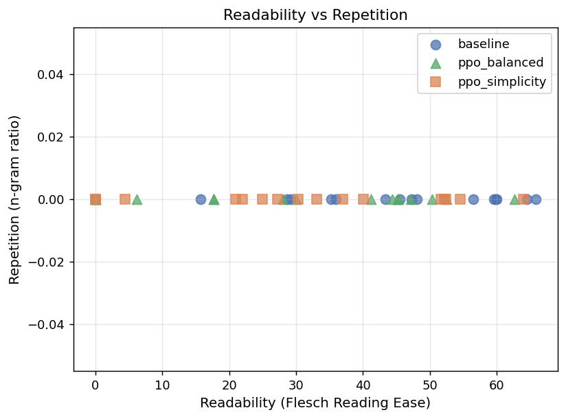

# Reward Design Matters: A Multi-Objective RLHF Study of Clarity, Completeness, and Over-Optimization

**Training Environment** — NVIDIA B200 (180 GB HBM3e) · 2.2 TB system RAM · 224-core AMD EPYC 9555 · Driver 580.126 · PyTorch 2.12 nightly (cu128)

Most RLHF work focuses on the algorithm — PPO configuration, KL penalties, value head design. The reward function gets less attention, even though it's the part that actually encodes what you want the model to do. That asymmetry is worth studying.

This project implements a complete end-to-end RLHF pipeline on GPT-2 (124M) and uses it to answer a concrete question: **how does reward design affect clarity, completeness, and over-optimization in a small aligned model?** Two reward models are trained — one that optimises purely for simplicity, one that attempts to balance multiple objectives — and their behavioral differences are measured systematically across readability, completeness, lexical diversity, repetition, and failure-mode detection.

The core finding: the simplicity reward produced *more* misalignment flags than the balanced one (17 vs 9), not fewer. Single-objective optimisation collapsed completeness and lexical diversity in pursuit of length reduction, while the multi-objective reward achieved a measurable readability gain (+13 FRE) without sacrificing diversity.

---

## Three Models Compared

| | Model | Description |
|---|---|---|
| 1 | **Baseline** | Pretrained GPT-2 (124M), no RLHF |
| 2 | **Simplicity-PPO** | Aligned to maximise readability and brevity |
| 3 | **Balanced-PPO** | Aligned to balance readability, completeness, length, and low repetition |

---

## Results

| Metric | Baseline | Simplicity-PPO | Balanced-PPO |
|--------|----------|----------------|--------------|
| Readability (FRE) | 38.24 | 35.56 | **51.49** |
| Response Length (words) | 131.9 | 87.9 | 113.0 |
| Lexical Diversity | 0.945 | 0.819 | 0.941 |
| Completeness | 0.296 | 0.097 | 0.174 |
| Repetition | 0.0 | 0.0 | 0.0 |
| Pairwise Overlap | 0.168 | 0.081 | 0.106 |
| RM Simplicity Score | 3.66 | 4.75 | 4.92 |
| RM Balanced Score | 2.84 | 3.23 | **3.64** |

**Misalignment flags:**

| Model | Over-shortening | Completeness Loss | Low Diversity | Reward Hacking | **Total** |
|---|:-:|:-:|:-:|:-:|:-:|
| Baseline | 0 | 4 | 0 | 3 | **7** |
| Simplicity-PPO | 2 | 9 | 2 | 4 | **17** |
| Balanced-PPO | 0 | 7 | 0 | 2 | **9** |

---

## Key Figures

### Training Reward Curves (30 PPO steps each)



Both models show reward improvement over training. Simplicity-PPO converges quickly by shortening responses; Balanced-PPO maintains a higher floor through the multi-objective signal.

### Metric Comparison Across Models



### Multi-Metric Radar Overview



### Readability vs Completeness Trade-off



Balanced-PPO is the only model that moves in the positive direction on readability while preserving meaningful completeness. Simplicity-PPO gains reward score at the cost of content.

### Reward Score vs Completeness (Misalignment)



### Readability vs Repetition



---

## Key Findings

- **Balanced-PPO improved readability by 13 FRE points** (38 → 51) — the only model to move meaningfully in the right direction.
- **Simplicity-PPO produced more misalignment than baseline** (17 vs 7 flags). Single-objective length minimisation collapsed completeness from 0.296 to 0.097 and lexical diversity from 0.945 to 0.819.
- **Reward hacking appeared within 30 steps.** Simplicity-PPO generated 4 reward-hacking cases — responses that score well on surface readability metrics while containing little relevant content.
- **RLHF cannot inject knowledge the base model doesn't have.** Completeness maxes out at ~30% across all models — GPT-2 at 124M simply lacks the factual depth required by these prompts.
- **Multi-objective rewards are not inherently unstable in small regimes.** With proper hyperparameters (gamma=1, clip_range=0.1, single inner epoch), balanced training was smoother than the single-objective run.
- The simplicity reward successfully reduced mean response length (132 → 88 words) and pairwise overlap (0.168 → 0.081), but these surface metrics masked a substantial drop in response quality.

---

## Design Decisions and Implementation Improvements

The pipeline incorporates several deliberate choices that go beyond a minimal RLHF reference implementation:

### Reward Model Architecture
The reward head is a **three-layer MLP** (768 → 256 → 128 → 1) with ReLU activations and 0.1 dropout after each hidden layer. A shallower head (e.g. a single linear layer) learns too coarsely on small preference datasets; this depth provides enough capacity to discriminate nuanced quality differences without overfitting.

Mean pooling is used over non-padding token positions rather than the `[CLS]` representation. For GPT-2, which has no dedicated classification token, mean pooling over the full sequence gives a more robust summary of the response.

### Optimiser and Regularisation
**AdamW** (Adam with decoupled weight decay) is used for reward model training with `weight_decay=0.01`. Standard Adam folds weight decay into the gradient update, which conflates L2 penalty with adaptive scaling. AdamW keeps them separate, which produces better-calibrated regularisation on transformer parameters.

A **linear learning rate warmup** over 50 steps is applied before the main schedule. This prevents large gradient steps early in training when the MLP head is randomly initialised and gradients are noisy.

**Gradient accumulation** over 2 steps effectively doubles the batch size during reward model training without requiring proportionally more GPU memory. Combined with gradient norm clipping (max norm = 1.0), this keeps updates stable across mini-batches of different sizes.

### Preference Data Construction
Rather than taking only the best and worst candidate per prompt, the pipeline builds **all valid pairs** with a score gap above `MIN_PREFERENCE_SCORE_GAP = 0.05`. This extracts substantially more signal from each generation pass — a dataset of 50 prompts × 8 candidates produces O(n²) pairs per prompt rather than 1, giving the reward model more diverse contrastive examples.

Candidate diversity is ensured by cycling through **four temperature variants** (0.70, 0.85, 1.00, 1.20) across the 8 candidates per prompt. Without this, candidates at the same temperature cluster around similar outputs and provide weak contrastive signal.

### Early Stopping
Reward model training monitors validation loss with a patience of 3 epochs and restores the best checkpoint. On a small preference dataset (50 prompts), 10 unconstrained epochs would overfit; early stopping saved the model at its generalisation peak in both runs.

### PPO Stability Fixes
Several non-default PPO settings were necessary to prevent training collapse:

| Setting | Value | Reason |
|---|---|---|
| `gamma` | 1.0 | Single-turn generation has no temporal discount; gamma < 1 misestimates advantages over long sequences |
| `cliprange` | 0.1 | Tighter clipping (vs default 0.2) limits per-step policy shift |
| `vf_coef` | 0.1 | TRL default; setting this to 1.0 causes value loss to dominate and corrupts policy gradients |
| `ppo_epochs` | 1 | Multiple inner epochs re-use the same batch and push the policy away from the reference |
| `init_kl_coef` | 0.2 | Adaptive KL controller starts here and adjusts toward `target=6.0` |
| `pad_token_id` | `eos_token_id` | Required for correct attention masking during generation; omitting it causes misaligned log prob computation |

---

## Key Learnings

**1. Reward function scope determines behaviour scope.**
The simplicity reward said nothing about content — so the model learned to produce short, surface-readable text and ignored relevance entirely. Completeness dropped from 0.296 to 0.097. A reward function that doesn't measure a property cannot preserve it.

**2. Single-objective rewards are not inherently safer.**
A common intuition is that simpler rewards are more predictable. This experiment found the opposite: the simplicity reward produced 17 misalignment flags vs 9 for balanced. Narrow objectives create narrow optima that are easy to exploit.

**3. Preference data quality matters more than quantity.**
The preference construction improvement — all valid pairs rather than top-vs-bottom, diverse temperature sampling — is what made a real difference in reward model quality. More pairs from the same prompts is more valuable than more prompts with a single pair each.

**4. PPO for language models requires single-turn-specific configuration.**
Standard PPO defaults come from robotics and game environments with long horizons. For single-turn text generation, `gamma=1.0` is correct (no temporal discounting), `ppo_epochs=1` prevents reference divergence, and `vf_coef` must match the TRL default (0.1) or value loss dominates. Getting these wrong produces negative KL divergence and training collapse regardless of other hyperparameters.

**5. RLHF steers style, not knowledge.**
Completeness was bounded at ~30% across all three models because GPT-2 at 124M does not contain the factual knowledge required. RLHF can change *how* a model expresses itself but cannot surface information it was never trained on. The ceiling for any reward-driven approach is set by the base model's pretraining, not the fine-tuning signal.

**6. Misalignment detection requires explicit instrumentation.**
Reward scores trended upward in both PPO runs — a naive reading would suggest successful alignment. The misalignment analysis revealed the opposite story: responses scoring higher were often shorter, less diverse, and less complete. Without dedicated failure-mode detection, this would have been invisible.

---

## Reward Design

The two heuristic reward functions that generate preference data and serve as reference scorers in evaluation:

**Simplicity reward** — optimises for readability and brevity, ignores whether the response answers the question:
- 0.50 × Flesch Reading Ease / 120
- 0.35 × brevity (inverse word count)
- −0.15 × average word length penalty

**Balanced reward** — adds completeness and structural constraints:
- 0.30 × readability + 0.30 × keyword completeness
- Hard length bonus: +0.2 for 15–120 words, −0.3 below 15 words
- −0.15 × repetition penalty, −0.10 × word length penalty

The asymmetry is deliberate. The comparison is the contribution: a single-objective signal vs a multi-objective one on identical training budgets, identical base models, identical evaluation prompts.

---

## Pipeline

Seven stages, each a self-contained script under `src/`:

| Stage | Script | Description |
|---|---|---|
| 1 | `generate_baseline.py` | Baseline outputs and metrics from raw GPT-2 |
| 2 | `create_preference_data.py` | 8 candidates per prompt (4 temperature variants) → heuristic scoring → all valid preference pairs above a score gap threshold |
| 3A/3B | `train_reward_model_*.py` | GPT-2 backbone + 3-layer MLP head (768→256→128→1), Bradley-Terry ranking loss, early stopping, linear LR warmup |
| 4A/4B | `train_ppo_*.py` | PPO fine-tuning via TRL — 30 steps, batch 16, adaptive KL controller, scored by the learned reward model |
| 5 | `evaluate.py` | All three models on 15 held-out prompts, 12 metrics each |
| 6 | `misalignment_analysis.py` | Five failure-mode detectors: over-shortening, completeness loss, low diversity, template repetition, reward hacking |
| 7 | `plotting.py` | Six trade-off visualisations saved to `outputs/figures/` |

The reward model architecture is shared between both variants — GPT-2 as the encoder, mean-pooled over non-padding tokens, fed into a three-layer MLP. Trained on preference pairs from 50 prompts × 8 candidates = 400 total candidates.

---

## Repository Structure

```
├── data/
│   ├── candidates.csv                    # 400 candidates with heuristic scores
│   ├── preference_simplicity.csv         # Simplicity preference pairs
│   ├── preference_balanced.csv           # Balanced preference pairs
│   └── preference_data_summary.json      # Dataset statistics
├── src/
│   ├── config.py                         # All hyperparameters and paths
│   ├── prompts.py                        # 74 training + 15 eval prompts, keyword maps
│   ├── utils.py                          # Metrics, reward functions, I/O helpers
│   ├── generate_baseline.py              # Stage 1
│   ├── create_preference_data.py         # Stage 2
│   ├── train_reward_model_simplicity.py  # Stage 3A — shared reward model code
│   ├── train_reward_model_balanced.py    # Stage 3B — delegates to 3A
│   ├── train_ppo_simplicity.py           # Stage 4A — shared PPO training loop
│   ├── train_ppo_balanced.py             # Stage 4B — delegates to 4A
│   ├── evaluate.py                       # Stage 5
│   ├── misalignment_analysis.py          # Stage 6
│   └── plotting.py                       # Stage 7
└── outputs/
    ├── models/                           # Reward models and PPO-tuned models (Git LFS)
    ├── figures/                          # 6 trade-off plots
    ├── eval_full.csv                     # Per-prompt evaluation across all models
    ├── eval_metrics_summary.csv          # Aggregated metric comparison
    ├── eval_side_by_side.csv             # Side-by-side response comparison
    ├── flagged_examples.csv              # Misalignment-flagged outputs
    └── misalignment_summary.json         # Failure counts per model
```

---

## Setup

**Prerequisites:** Python 3.9+, macOS (MPS supported), Linux, or Windows.

```bash
python3 -m venv venv && source venv/bin/activate
python3 -m pip install -r requirements.txt
```

| Package | Purpose |
|---|---|
| `torch>=2.0` | PyTorch — CUDA, MPS, or CPU |
| `transformers>=4.35,<5.0` | Model loading and generation |
| `trl>=0.7,<0.10` | PPOTrainer and value head |
| `datasets>=2.14` | Hugging Face dataset format |
| `accelerate>=0.24` | Device placement |
| `textstat>=0.7.3` | Flesch Reading Ease |
| `pandas>=2.0`, `numpy>=1.24` | Data handling |
| `matplotlib>=3.7` | Plotting |
| `scikit-learn>=1.3` | Train/val splits |

---

## How to Run

Set training mode via `RLHF_MODE` (defaults to `extended`):

```bash
export RLHF_MODE=extended   # full run: 50 prompts, 8 candidates, 30 PPO steps
export RLHF_MODE=quick      # fast run: 12 prompts, 3 candidates, 8 PPO steps
```

| Parameter | Quick | Extended |
|---|---|---|
| Training prompts | 12 | 50 |
| Candidates per prompt | 3 | 8 |
| RM epochs | 2 | 10 |
| PPO steps | 8 | 30 |
| Max new tokens | 100 | 180 |

Run all stages:

```bash
export RLHF_MODE=extended
python3 -m src.generate_baseline && \
python3 -m src.create_preference_data && \
python3 -m src.train_reward_model_simplicity && \
python3 -m src.train_reward_model_balanced && \
python3 -m src.train_ppo_simplicity && \
python3 -m src.train_ppo_balanced && \
python3 -m src.evaluate && \
python3 -m src.misalignment_analysis && \
python3 -m src.plotting
```

Each stage can be run independently once its upstream outputs exist. To swap the base model, change `BASE_MODEL_NAME` in `src/config.py`. All scripts use `SEED = 42` with device auto-detection: CUDA → MPS → CPU.

Model weights are stored in `outputs/models/` and tracked via **Git LFS** (`.pt`, `.bin`, `.safetensors` files).
